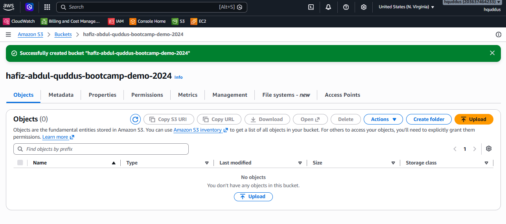
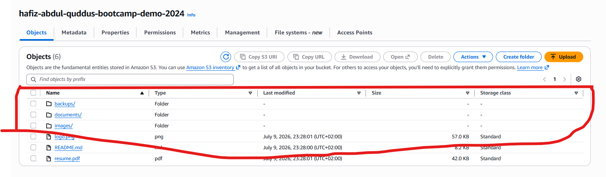
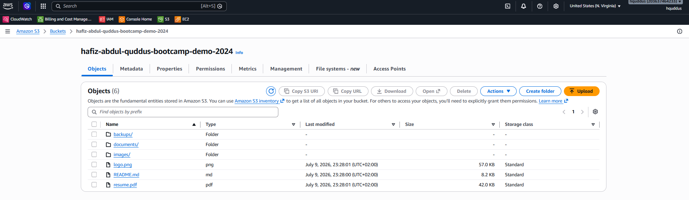
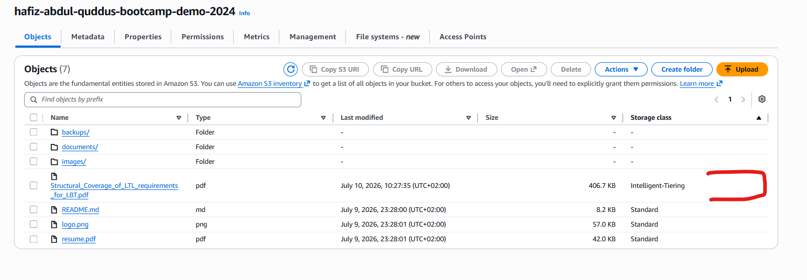
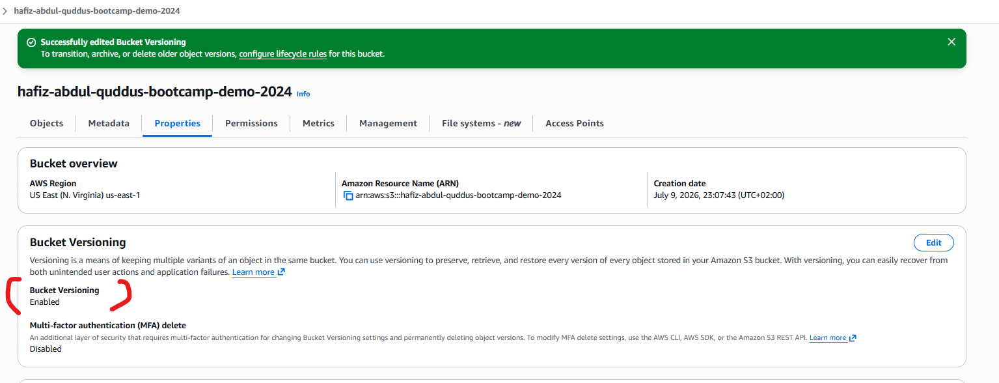
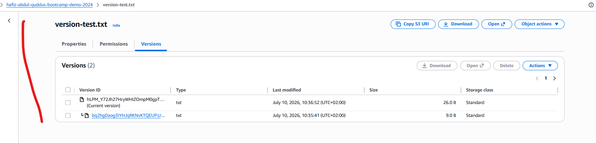
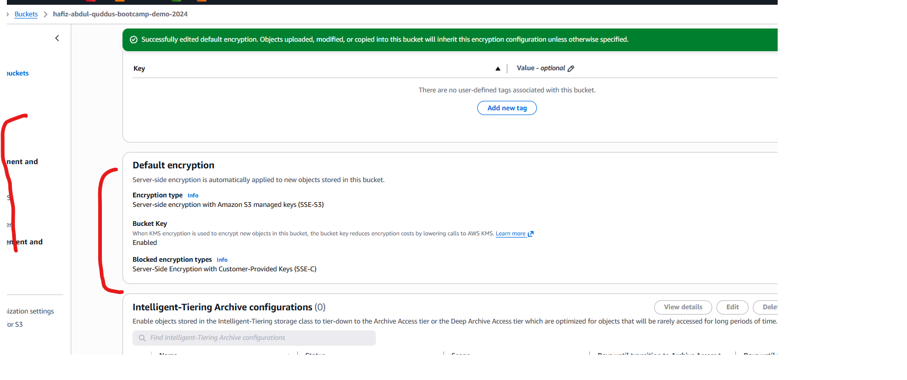
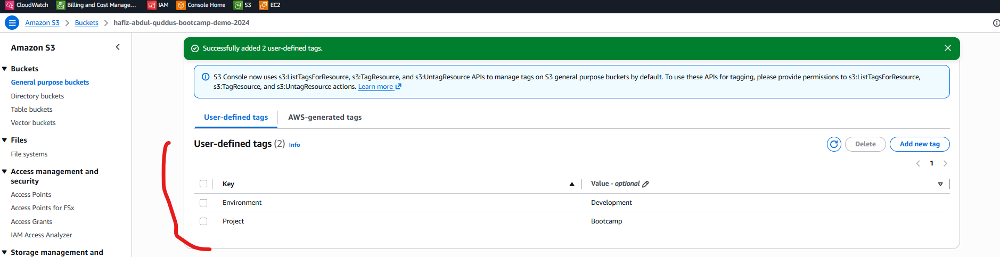
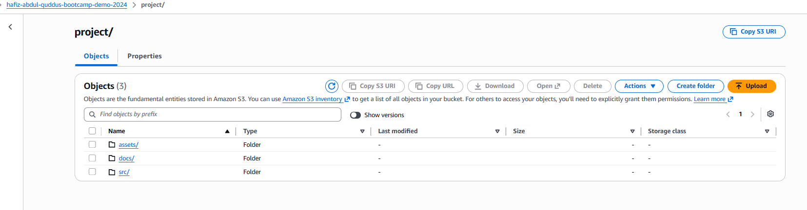
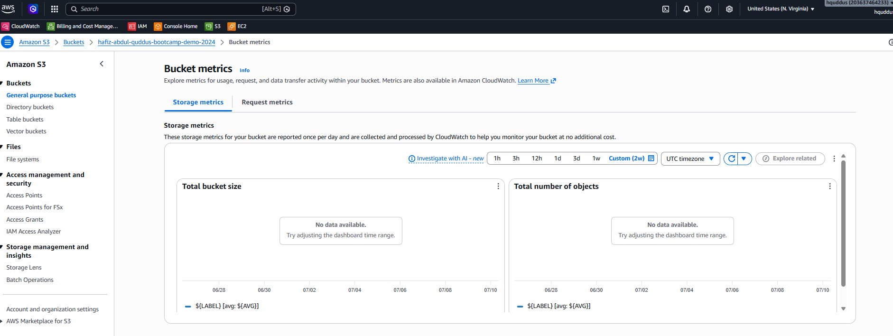

# Create S3 Bucket Lab - Solution

**Student Name:** Hafiz Abdul Quddus
**Date:** 10-07-2026

---

## Exercise 1: Bucket Creation

**Bucket Name:** hafiz-abdul-quddus-bootcamp-demo-2024
**Region:** us-east-1

---

## Exercise 2: Object Uploads

### Files Uploaded:

1. [File 1 name and type]
2. README.md          text/markdown
3. resume.pdf            application/pdf
4. logo.png                image/png

### Folder Structure:

**Folders Created:**

- images/
- documents/
- backups/

---

## Exercise 3: Storage Classes

**Storage Classes Used:**

- Standard: [README.md, logo.png, resume.pdf objects
- Standard-IA: Structural_Coverage_of_LTL_requirements_for_LBT.pdf objects later its edited into Intelligent-Tiering
- Intelligent-Tiering:  Structural_Coverage_of_LTL_requirements_for_LBT.pdf objects

---

## Exercise 4: Bucket Features

### Versioning:

**Number of versions created:** [X]

### Encryption:

**Encryption type:** SSE-S3

### Tags:

**Tags Added:**

- Environment: Development
- Project: Bootcamp

---

## Exercise 5: Download/Delete

**Operations Completed:**

- [X] Downloaded object via console
- [X] Downloaded object via CLI
- [X] Deleted object via console
- [X] Deleted object via CLI

---

## Exercise 6: Sync Operations

**Files Synced:** 3
**Total Size:** 53B (13 + 16 + 24)

---

## Exercise 7: Metrics

**Bucket Statistics:**

- Total objects: 13
- Total size:   539702 B
- Storage class distribution:  NA
- I got this summary from:  aws s3 ls s3://hafiz-abdul-quddus-bootcamp-demo-2024/ --recursive

---

## Bonus Challenges : NA

### Lifecycle Policy:

**Policy Rules:**

- [X] Transition to Standard-IA: 30 days
- [X] Transition to Glacier: 90 days
- [X] Delete: 365 days

---

## CLI Outputs

See `cli-outputs.txt` for all command outputs.

---

## Reflection

**What did you learn about S3?**
[Your answer]S3 is a scalable object storage service used to store and manage data securely. It is like a hard disk drive over the AWS cloud environment.

**When would you use different storage classes?**
For better usage, storage classes are used based on data access needs and cost optimization.

---

## Checklist

- [X] Bucket created
- [X] Objects uploaded (console and CLI)
- [X] Folders created
- [X] Storage classes configured
- [X] Versioning enabled and tested
- [X] Encryption enabled
- [X] Tags added
- [X] Sync completed
- [X] All screenshots captured
- [X] Bucket cleaned up (deleted)

**Completed By:** Hafiz Abdul Quddus
